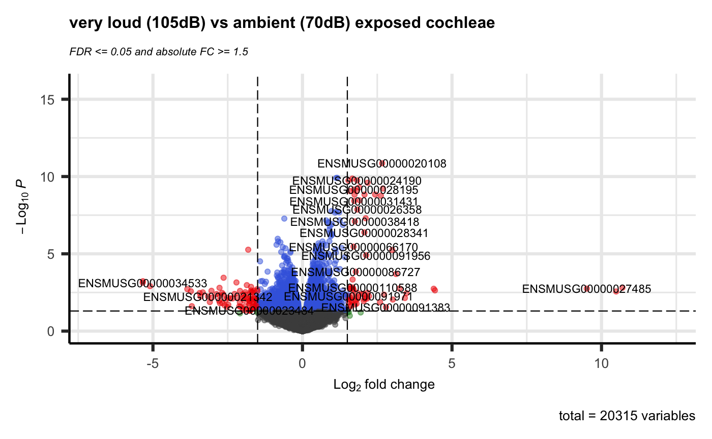
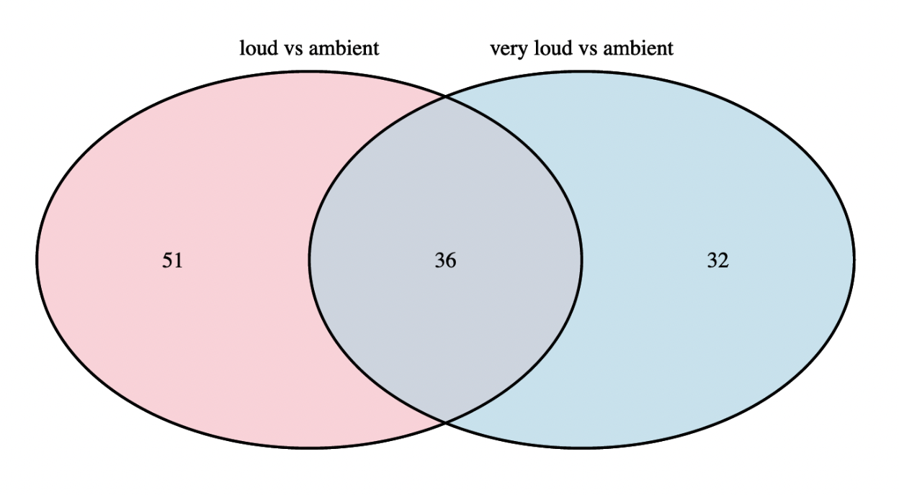

# Noise Induced Hearing Loss and Gene Expression Analysis using the R language

## Introduction
Exposure to loud noise can cause hearing sensitivity or hearing loss. 
Intensity and duration dictate the shift in the hearing threshold and whether it is temporary or permanent. 
Despite knowing the clear physiological definitions, what still is unknown is a comprehensive understanding of 
the complex molecular mechanisms responsible for noise-induced threshold elevation and the processes responsible for hearing threshold recovery.

The aim of the chosen research [1] was to obtain a deep understanding of the mechanisms contributing to NIHL, 
since this could accelerate the ability to develop strategies for prevention and treatment. 
Multiple experiments were performed using the cochlea of mice that were exposed to different sound pressure levels (SPL).

The goal of this project is to try to replicate one of the experiments that was done as part of the chosen research; 
the RNA-sequencing analysis of gene expression in cochlea.

## Materials and Methods
60-day old awake mice (Mus Musculus) were exposed to 70, 94 and 105dB SPL for 30 minutes and immediately after noise exposure the cochlea were removed and their RNA sequenced. 
The resulting count data has 3 sample groups, each with 4 replicates and is publicly available as a single tab-separated file [2].

The programming language R was used in Rstudio to perform the statistical analysis and to find differentially expressed genes (DEGs). 
Creating an RMarkdown file as the final product.

The quality and structure of the data was sufficient and did not need cleaning, 
it was only eventually filtered to only contain genes with a count of at least 8 in 4 samples. 
The Bioconductor package edgeR was used to perform the actual analysis and the data was normalized using edgeR's TMM (Trimmed Mean of M-values) normalization method.

Genes with an adjusted P value < 0.05 and fold change > 1.5 found by edgeR were assigned as differentially expressed genes.

## Results
Using the edgeR library, statistical tests and comparisons between sample groups were done, resulting in datasets with p-values and fold change (FC) values and more for the genes. 
The resulting datasets were visualized in volcano plots, highlighting the genes considered DEGs as red by implementing the p-value and FC thresholds (Figure 1).

> **Figure 1: Volcano Plot plotting all genes with their -log10 p-value against log2 fold change.**  
> *Blue dots are statistically significant but don't have a high enough fold change. 
> Gray dots have neither significance nor a high enough fold change. 
> Red dots have both significance and a high enough fold change and are thus considered DEGs.*

To show the amount of genes that are considered differentially expressed in both comparisons against the control group, a Venn diagram was made (Figure 2). 
In the end a total of 119 DEGs were found, of which 36 are shared between both comparisons and thus these are considered the most important.

> **Figure 2: Venn Diagram showing the amount of shared DEGs between group comparisons.**

## Conclusion / Discussion
The majority of DEGs found are up-regulated, this was kind of surprising because you'd think that there would mainly be down-regulation because you ’lose’ a bit of hearing. 
This could possibly be because the genes are expressed more to try and fix damage caused by the noise insults.

When performing Multi-Dimensional scaling the replicates clustered nicely and the very loud group was found to be more similar to the ambient group than to the loud group. 
This is however in line with the amount of DEGs found in both groups, with only 68 found in the very loud group and 87 in the loud group.

An extra step that could have been performed is doing the analysis using different normalization methods or packages, this could lead to different results and/or strengthen the already achieved results. 
The next step after this experiment would be to look at the discovered DEGs in more detail and find out what their function is.